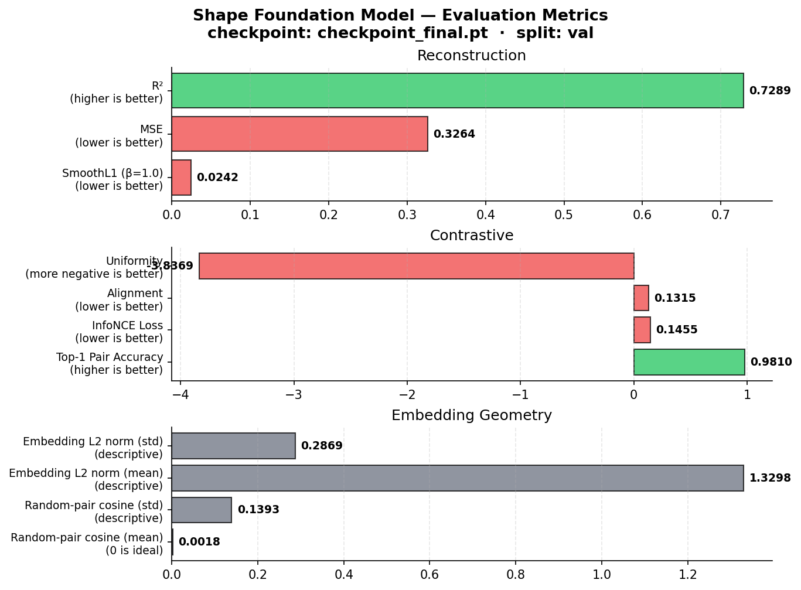

# Shape Foundation Model 

A 3D geometry foundation model for industrial CAD analysis. Takes a mesh of a physical domain and produces dense geometric embeddings with a self-supervised reconstruction prior that enables per-token attribution for explainable predictions.

## Current Release

**Small v3** — self-supervised backbone, trained and validated.

| | |
|---|---|
| Parameters | 10,913,297 |
| Training data | 61,052 CAD meshes |
| Datasets | Fusion360 (58.4%), MFCAD (25.4%), Thingi10K (16.2%) |
| Train / val split | 58,069 / 2,983 (deterministic hash-based) |
| Compute | 8 × H100 80GB, 50 epochs, ~2h 30min |
| Val reconstruction R² | **0.729** |
| Val SmoothL1 (masked, β=1.0) | **0.024** (matches training loss curves) |
| Contrastive top-1 pair accuracy | **98.1%** |
| Precision | bf16 + DDP + torch.compile |
| Model hub | [`bayang/shape-foundation-small-v3`](https://huggingface.co/bayang/shape-foundation-small-v3) |

The self-supervised backbone generalizes to unseen meshes. Supervised task heads (symmetry, primitive, part, reduction) are present in the architecture but their weights are currently `0.0` — the stock synthetic labels do not generalize and would overfit the model. See [Known Limitations](#known-limitations) below.

## Results

All metrics are computed on the held-out validation split (N = 2,983 meshes, deterministic hash-based split).

### Reconstruction (pretraining objective)

Masked-token reconstruction measured in the same normalized target space used during training. 50% of latent tokens are masked and predicted from the remaining context.

| Metric | Value | Notes |
|---|---:|---|
| `recon_smoothl1` (β=1.0) | **0.024** | Matches `train_epoch/masked_token_raw` — no train/val gap |
| `recon_mse` | 0.326 | Reference squared error in normalized space |
| `recon_r2` | **0.729** | Coefficient of determination: 72.9% of masked-token geometry variance explained from surrounding context |

### Contrastive embedding quality (Wang & Isola, 2020)

Augmented views are generated with the same jitter (σ = 0.02) and point dropout (30%) used in training. Positive pairs must match through cosine similarity; the pool size is 2,048 meshes.

| Metric | Value | Notes |
|---|---:|---|
| `contrastive_top1_acc` | **98.1%** | Positive pair is top-1 nearest neighbor under cosine similarity |
| `contrastive_infonce` (τ=0.07) | **0.146** | Symmetric InfoNCE on (clean, augmented) pairs |
| `contrastive_alignment` | 0.132 | E‖f(x) − f(y)‖² for positive pairs (lower = augmentation-invariant) |
| `contrastive_uniformity` | −3.84 | log E[exp(−2‖f(x) − f(y)‖²)] over random pairs (more negative = more uniform coverage) |

### Embedding geometry (descriptive)

| Metric | Value | Notes |
|---|---:|---|
| `pairwise_cosine_mean` | 0.002 | Random mesh pairs are ~orthogonal — well-spread embedding space |
| `pairwise_cosine_std` | 0.139 | Spread of the pairwise similarity distribution |
| `embedding_norm_mean` | 1.33 | Pre-normalization L2 norm |
| `embedding_norm_std` | 0.29 | Consistent across meshes |



Raw artifacts are checked into `results/`:

| File | Purpose |
|---|---|
| `results/small_v3_eval_val.json` | Structured JSON payload with timestamp, checkpoint, metrics |
| `results/small_v3_eval_val.csv` | Single-row flat CSV (plot-friendly) |
| `results/eval_history.csv` | Append-mode history across runs for cross-version tracking |
| `results/plots/metrics_summary.png` | Horizontal bar chart of all metrics |
| `results/plots/alignment_uniformity.png` | Wang & Isola (2020) diagnostic scatter |

### How to reproduce

```bash
# Run full eval on the val split
python -m shape_foundation.scripts.eval_backbone \
    --checkpoint checkpoints/checkpoint_final.pt \
    --output results/small_v3_eval_val.json \
    --history results/eval_history.csv

# Regenerate plots
python -m shape_foundation.scripts.plot_eval_metrics \
    --csv results/small_v3_eval_val.csv \
    --history results/eval_history.csv \
    --output results/plots/
```

## Architecture

**GAOTBackbone** = MAGNO Encoder → Transformer Processor → Task Heads

- **MAGNO Encoder** — cross-attends from a structured 3D latent grid (24³ = 13,824 tokens) to 8,192 sampled surface points using cosine-similarity attention with learned temperature. Each token encodes local geometric statistics (mean / std / min / max of relative positions, normals, curvature) in a 28-dim signature.

- **Transformer Processor** — 3D patchification (patch_size=6), grouped-query attention with RMSNorm, optional RoPE positional embeddings, unpatchification back to dense token embeddings.

- **Task Heads** — geometry embedding (global pooled), reconstruction projection (for pretraining), plus symmetry, primitive, part, caption, and topology-reduction heads (currently disabled pending label rework).

### Pretraining objectives

Self-supervised only — no labels required.

1. **Masked Token Reconstruction** (weight 1.0) — 50% of latent tokens are masked; the model predicts their geometry statistics from surrounding context. Analogous to masked-language-modeling in LLMs but in 3D latent space. SmoothL1 loss (β=1.0) in normalized target space.

2. **Multi-resolution Contrastive Consistency** (weight 0.2) — the same mesh under two augmentations (position jitter σ=0.02, 30% point dropout) must embed similarly. InfoNCE with temperature 0.07.

### Key engineering decisions

- **Per-dimension target normalization is the decisive intervention** — `raw_geo_stats` has 28 dimensions with std spanning `[0.036, 711]` because mesh curvature is heavy-tailed on sharp CAD features. Without normalization, any symmetric regression loss (MSE or SmoothL1) is dominated by a handful of curvature dimensions and fails to train (`R² < 0.14`, top-1 retrieval `< 88%`, see ablation below). With per-dim z-scoring applied to targets — calibrated once on the training split at startup and stored as registered buffers — both MSE and SmoothL1 reach `R² > 0.70` and top-1 `> 96%`. Normalization alone closes the gap.
- **SmoothL1 instead of MSE is a secondary stability choice** — once normalization is applied, MSE and SmoothL1 are statistically indistinguishable at 20 epochs (`R² = 0.777` vs `0.702`, top-1 `96.7%` vs `97.1%`). We retain SmoothL1 (β=1.0) as the default for its bounded-gradient property in the tail, which matters for long 50-epoch training runs under bf16 where the occasional numerical spike can destabilize MSE. It is a safety hedge for deployment, not a performance win.
- **Deterministic hash-based train/val split** — each file's split assignment is `md5(path) mod 10000 < val_fraction × 10000`. Identical across runs, ranks, and machines.
- **Atomic checkpoint saves** — writes to `<path>.tmp`, fsyncs, then `os.replace` to the final name. A failed save never leaves a corrupt checkpoint.

### Ablation of training interventions

A controlled 2×2 ablation across `{MSE, SmoothL1} × {raw targets, per-dim normalized targets}`, 20 epochs per variant, validates that normalization is the dominant effect:

| Loss | Target norm | R² | Top-1 | Alignment | Uniformity |
|---|---|---:|---:|---:|---:|
| MSE | none | 0.133 | 76.1% | 0.366 | −3.37 |
| SmoothL1 | none | 0.061 | 87.6% | 0.318 | −3.71 |
| MSE | per-dim | **0.777** | 96.7% | 0.191 | −3.80 |
| SmoothL1 (ours) | per-dim | 0.702 | **97.1%** | **0.180** | **−3.82** |

R² is reported in the target space each variant was trained on (raw for no-normalization rows, z-scored per-dimension for normalized rows). Top-1, alignment, and uniformity are scale-free and directly comparable across all rows. See `results/ablations/` for the raw CSVs and plots.

## Installation

```bash
# System dependencies
sudo apt-get install -y aria2 p7zip-full libxcursor1 libxinerama1 libxft2 libxmu6 libxi6 libglu1-mesa libgl1

# Python dependencies — install torch first, PyG builds against it
pip install torch --index-url https://download.pytorch.org/whl/cu124
pip install torch-geometric torch-cluster torch-scatter -f https://data.pyg.org/whl/torch-2.6.0+cu124.html
pip install -e .
```

Requires Python ≥3.10, CUDA 12.4+, PyTorch ≥2.6.

## Quick Start

Reproduce the small v3 training run from scratch. Three steps: download the raw datasets, preprocess them into `.pt` files, then train.

```bash
# 1. Download raw meshes from their public sources (Thingi10K, MFCAD, Fusion360)
./scripts/download_datasets.sh small

# Fusion360 segmentation subset (manual step — not automated by the script)
aria2c -x 16 -s 16 -d data_raw/fusion360 -o s2.0.1.zip \
  "https://fusion-360-gallery-dataset.s3.us-west-2.amazonaws.com/segmentation/s2.0.1/s2.0.1.zip"
unzip -q -o data_raw/fusion360/s2.0.1.zip -d data_raw/fusion360

# 2. Preprocess each source into .pt files (parallelized, resumable)
python -m shape_foundation.scripts.prepare_dataset --source thingi10k --root data_raw/thingi10k --output data_cache/thingi10k
python -m shape_foundation.scripts.prepare_dataset --source mfcad    --root data_raw/mfcad    --output data_cache/mfcad
python -m shape_foundation.scripts.prepare_dataset --source fusion360 --root data_raw/fusion360 --output data_cache/fusion360

# 3. Train on 8 GPUs (~2h 30min on 8 × H100 80GB)
torchrun --nproc_per_node=8 -m shape_foundation.scripts.train_pretrain --config configs/small.yaml
```

Preprocessing takes roughly 1 hour on a 32-core machine for the small tier. STEP files (MFCAD, Fusion360) are slower than STL/OBJ because gmsh has to tessellate the CAD geometry before sampling surface points.

Alternatively, you can skip training entirely and just download the pretrained weights from [HuggingFace](https://huggingface.co/bayang/shape-foundation-small-v3):

```bash
hf download bayang/shape-foundation-small-v3 --local-dir checkpoints/
```

then jump straight to Evaluation or Inference below.

## Evaluation

```bash
python -m shape_foundation.scripts.eval_backbone \
    --checkpoint checkpoints/checkpoint_final.pt
```

Loads the checkpoint, runs the evaluator on the validation split, and writes `checkpoint_final_eval_val.json` next to the checkpoint. Use `--split test` or `--robustness` to change behavior.

## Inference

```bash
python -m shape_foundation.scripts.infer_mesh \
    --checkpoint checkpoints/checkpoint_final.pt \
    --mesh path/to/mesh.stl
```

For an interactive 3D demo with masked-token reconstruction heatmaps and shape retrieval, visit **[shape.simd.space](https://shape.simd.space)**.

## Configuration

All configuration is dataclass-based in `shape_foundation/configs/default.py`. YAML files in `configs/` override the defaults via deep merge.

| Config | Parameters | Latent Grid | Token Dim | Layers × Heads | Status |
|---|---|---|---|---|---|
| `small.yaml` | 10M | 24³ | 128 | 3 × 4 | Trained ✅ |
| `medium.yaml` | ~300M | 48³ | 256 | 6 × 8 | Next |
| `large.yaml` | ~1B | 64³ | 512 | 12 × 16 | Planned |

### Tuning common parameters

Edit the YAML or override on the command line:

```bash
python -m shape_foundation.scripts.train_pretrain --config configs/small.yaml --epochs 100 --batch-size 32 --lr 1e-4
```

## Scaling Strategy

All scaling is config-only — no architectural changes needed.

| Axis | Small (v1) | Medium (v2) | Large (v3) |
|---|---|---|---|
| Parameters | 10M | 300M | 1B |
| Latent grid | 24³ | 48³ | 64³ |
| Hidden dim | 128 | 256 | 512 |
| Transformer layers | 3 | 6 | 12 |
| Training meshes | 61k | 500k | 2M+ |
| Data sources | Thingi10K + MFCAD + Fusion360 | + Objaverse + PartNet | + ABC + Objaverse-XL |
| Mask ratio | 0.5 | 0.5 | 0.75 |

What stays constant: MAGNO cross-attention, grouped-query attention, self-supervised objective, per-dim target normalization, SmoothL1 regression.

## Datasets

| Dataset | Meshes | Format | Source |
|---|---|---|---|
| Thingi10K | 9,883 | STL / OBJ | [HuggingFace](https://huggingface.co/datasets/Thingi10K/Thingi10K) |
| MFCAD++ | 15,488 | STEP | [GitHub](https://github.com/hducg/MFCAD) |
| Fusion360 | 35,681 | STEP / BREP | [AWS S3](https://fusion-360-gallery-dataset.s3.us-west-2.amazonaws.com/segmentation/s2.0.1/s2.0.1.zip) |

Check dataset status at any time with `./scripts/check_datasets.sh`.

## Known Limitations

**Supervised task heads are disabled in v3 (small).** The symmetry, primitive, part, and reduction heads are architecturally present but trained with weight `0.0`. Under previous runs with stock synthetic labels enabled, training cross-entropy collapsed to `~1e-4` while validation CE stayed at chance level (`~2.5`) — classic memorization of per-file label noise. Re-enabling these heads requires rewriting `shape_foundation/data/synthetic_labels.py` so the labels are recoverable from the sampled point cloud the model actually sees, not from full-mesh properties. **These heads will be activated in the medium and large releases** once the label generator is fixed and additional supervised datasets (PartNet, Scan2CAD) are integrated — the backbone's self-supervised quality ceiling is what's being validated at the small scale first.

**Contrastive loss saturates early at small scale.** With per-rank batch size 16, InfoNCE has only 15 negatives per anchor, which makes the objective too easy after a few epochs. Cross-rank negative sampling (via `dist.all_gather` on pooled embeddings) is planned for the medium release, where larger effective batch sizes and cross-device negatives keep the contrastive objective non-trivial for the full training budget.

## License

This library is licensed under the Apache 2.0 License. See the `LICENSE` file for more information.

You must not use this library or our models in a manner that infringes, misappropriates, or otherwise violates any third party's rights, including intellectual property rights.

Training data is used under the respective licenses of each upstream dataset (Thingi10K, MFCAD, Fusion360).
